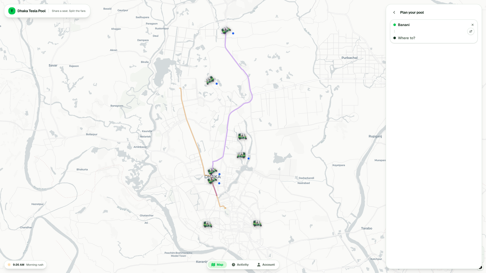

# Dhaka Tesla Pool 

*Share a seat. Split the fare. Survive Dhaka traffic.*

8:41 AM, Banani Road 11 — Jashim leans against **Bullet**, his 3-seat battery "Tesla". Nusrat books Banani → Mohakhali; Rafiq books Banani → Gulshan 1 two minutes later. The app pools them if they share route legs, splits each fare fairly, and shows Jashim who rides and when to go. Then Shirin races for the last seat.



- Backend (live): https://dtp-backend.vercel.app (`GET /health`)
- ERD + Architecture: https://excalidraw.com/#json=w__I65H8ONqTkhAb3vKMB,MIGnRpCFluSI9dg6bwuWIQ (static copy: `backend/dtp-erd.excalidraw`)
- Demo video: https://drive.google.com/file/d/14i2eLP8RnzAyFs5c5StKb3k8NM8S_UcU/view?usp=sharing_


**Map:** [mapcn](https://mapcn.dev/) components (`@/components/ui/map`) over [MapLibre GL](https://maplibre.org/) with free Carto tiles — no API keys. mapcn is shadcn-style copy-paste components (markers, popups, routes, controls) on top of MapLibre, Tailwind-native and zero lock-in; this app can drop to the raw `map` instance whenever needed. A predefined Dhaka road graph (`predefiend_routes.js`, 38 corridors) powers the pickers, fare estimates, and the fleet corridors that are always drawn on the map — live rides overlay on top.
    

## Tech stack


| Choice (non-mandated) | Alternatives | Why this MVP | Switch when |
|---|---|---|---|
| PostgreSQL | MongoDB, SQLite | `seats_taken <= capacity` needs transactions + CHECK constraints | Geo scale → PostGIS + read replicas |
| Express + Zod | NestJS, Fastify | Smallest surface for pooling logic, validated transitions | Team >5 → NestJS |
| MapLibre | Google/Mapbox (paid) | PRD §4: no map-API fights, free Dhaka tiles | Real ETA/traffic → Mapbox + self-host OSRM |
| Polling, not sockets | WS/SSE, Redux | Lifecycle updates only; less code than it saves | Live tracking → SSE/WS + React Query |
| JWT in localStorage | httpOnly cookies | Zero-infra demo | Prod now → httpOnly cookies + rotation |


## Features

- **Passenger (Nusrat, Rafiq, Shirin):** sign up/in, request ride (pickup → drop, seats, Wait & Save), server-priced estimate, live status, cancel while valid, own-fare-only view, history + rating + wallet.
- **Driver (Jashim/Bullet, Kabir/Rocket):** sign in, online/offline, request inbox, accept / hop-on join, arrived → start → complete, passenger list + per-trip audit trail, history.
- **Admin:** read-only `/admin` over `GET /admin/rides`. Every screen has loading/error/empty states.

## Answers to PRD questions

- **Matching rule (§4):** poolable iff trips share **≥ 1 leg** on the predefined Dhaka graph (`sharedLegs()`). Nusrat + Rafiq share the Banani corridor leg → pool; Mirpur → Uttara shares none → solo.
- **Fare (§5)** — all money is **integer paisa** (100 paisa = ৳1), so no float rounding; per-leg receipt stored in `fare_legs`. Cash or simulated TeslaPay, no gateway.

  $$\text{fare} = \text{base} + \text{distance} - \text{pool discount} - \text{wait-save}$$

  - **base** = ৳30 flat per passenger, always.
  - **distance** = sum of your legs, each leg ≈ ৳18/km × congestion (min ৳10/leg).
  - **pool discount** = per leg: ride alone → 0%, share with 1 person → 20% off that leg, share with 2 → 30% off.
  - **wait & save** (optional) = extra 5% off the distance part for waiting 5 min at pickup.
  - Example: Nusrat and Rafiq share one ৳50 leg and each rides one solo ৳40 leg → shared leg costs each $50 - 20\% = 40$; each pays $30 + 40 + 40 = 110$ (৳110).
- **Lifecycle (§3):** `REQUESTED → MATCHED → DRIVER_ARRIVED → STARTED → COMPLETED (+ CANCELLED)`; invalid transitions rejected server-side. Ride born at `MATCHED` on driver accept.
- **Concurrency (§12):** 1 seat left, Nusrat + Shirin claim at once → Postgres transaction + `SELECT … FOR UPDATE`, re-check inside lock, exactly one wins (other gets 409). `seats_taken <= capacity` holds as a DB CHECK backstop. Scale-up: per-vehicle queue/Redis lock + existing `idempotency_key` + retry.
- **Viral scale (bonus):** stateless API + LB, read replicas, Redis cache + geo index, per-vehicle matching queue, rate limit + idempotency, WS fan-out, observability, same Docker image rollout.
- **Architecture (§9):** `Browser → Next.js → Express API → PostgreSQL`. Frontend holds no authority: `lib/api.ts` is the only backend seam, `components/store.tsx` is a polling mirror. Tables: `stops, legs, routes, route_stops, users, vehicles, rides, ride_requests, fare_legs, ride_events, wallets, wallet_transactions`.

## Run

```bash
npm install
npm run dev                        # http://localhost:3000
# use hosted backend:
# NEXT_PUBLIC_API_URL=https://dtp-backend.vercel.app npm run dev
npm run build / npm start / npm run lint
```

Backend (from `backend/`): `cp .env.example .env` → `npm install` → `npm run db:setup` (migrate + seed cast) → `npm run dev` (`:4000`); Docker: `docker compose up --build`. Vercel serves Express via `backend/api/index.ts` (migrations run separately). Tests: `npm test` (capacity, transitions, pooled fares, cross-user block, cancel rules, last-seat race).

Env: `NEXT_PUBLIC_API_URL` (default `http://localhost:4000`, prod `https://dtp-backend.vercel.app`). Backend needs `DATABASE_URL`, `JWT_SECRET` — never commit secrets.

## Demo accounts (password: `demo1234`)

| Name | Role | Phone |
|---|---|---|
| Nusrat | Passenger | `+8801710001001` |
| Rafiq | Passenger | `+8801710001002` |
| Shirin | Passenger | `+8801710001003` |
| Jashim (Bullet, 3 seats) | Driver | `+8801810002001` |
| Kabir (Rocket, 3 seats) | Driver | `+8801810002002` |
| Admin | Admin | `+8801910009001` |

One-tap logins on `/login`.

## Key decisions / limitations / next

Server-priced fares (client never computes); co-riders stripped to `{ id, firstName, dropStopId, status }`; joins via `POST /rides/:id/join` (≥1 shared leg only); audit via `GET /rides/:id/events`. Limits: I used polling (2.5s) instead of websockets to keep it simple — status updates arrive with a small delay rather than instantly; map autos are client-side simulation; JWT in localStorage (demo). Next: SSE/WS push, PostGIS, cookie auth, Playwright E2E.

## AI usage (§8)

AI was used as a normal engineering tool throughout — scaffolding, boilerplate review, and docs — and every line was reviewed; I can explain, debug, and redesign any part live.

- Planning: GPT 5.6 for system design and breakdown; editor setup Sol via http://zed.dev/
- Model usages: MapLibre scaffolding, fare-table UI, Zod schema review, README shape
- Implementation: built with [ZCode](https://zcode.z.ai/en) + [opencode.ai](https://opencode.ai)
- Models used: GLM 5.3 Flash, stealth/space-bunny
- Total usage and cost: **~140M** tokens, est.
- Apporximate costs upto **$3 USD** for the entire project, including planning, scaffolding, and implementation.

## Git & assumptions

Branches `master`, `pre-release`, `release/v1.0.0` + `feature/*`; commits `<type>(<scope>): <desc>`. Assumes: fixed 3-seat Teslas, leg-overlap pooling, paisa cash/TeslaPay, polling OK for MVP.
