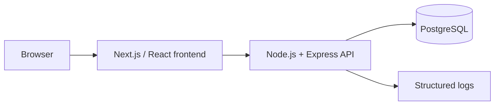
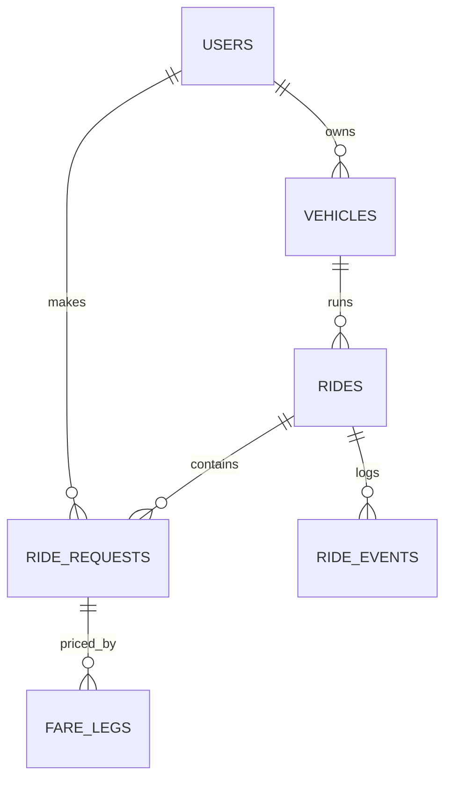

# Dhaka Tesla Pool: Product Requirements Document

**Cast used everywhere (seed data, tests, demo):** Driver **Jashim** with his 3-seat Tesla **Bullet**. Passengers **Nusrat**, **Rafiq**, **Shirin**.

---

# Part 1: Product

## 1. What the app does

Dhaka Tesla Pool lets passengers request a seat between two Dhaka areas. The system pools compatible riders into one shared Tesla (maximum 3 seats), the driver runs the trip, and each rider pays only for the part of the route they ride, with a discount on the parts they share. Each rider sees only their own fare and status. Every ride keeps enough history to explain later exactly what happened.

## 2. Who does what

| Role | Purpose | Main actions |
|---|---|---|
| **Passenger** (Nusrat, Rafiq, Shirin) | Get a cheap, shared ride | Request a ride, see fare, track status, cancel, view history |
| **Driver** (Jashim) | Run shared trips and earn more | Go online, accept a pool, mark arrival, start and end trip, view earnings |
| **Pool Engine** (system) | Match riders fairly and safely | Match requests, lock seats, calculate fares, enforce state rules, record history |
| **Admin view** (optional, read-only) | Demo and debugging | See all active rides and seat counts |

## 3. The story flow (how the roles connect)

1. **Nusrat** requests Banani to Mohakhali. She sees an estimated fare, confirms, and is `REQUESTED`.
2. **Rafiq** requests Banani to Gulshan 1. Same pickup zone, overlapping route, so the engine marks them poolable.
3. **Jashim** goes online and sees the pool. He accepts it. Both riders become `MATCHED` and Bullet shows 2 of 3 seats used.
4. **Shirin** requests at nearly the same moment as another rider for the last seat. Only one wins the seat. The other is told it is full and offered another option.
5. Jashim marks **arrived**, then **starts** the trip. A new rider can join mid-trip if a seat is free and the route fits.
6. Jashim drops Rafiq at Gulshan 1, then Nusrat at Mohakhali, then **ends** the trip. The ride is `COMPLETED`.
7. Each passenger sees their own itemised fare in history. Jashim sees all riders and his earnings.

## 4. Ride lifecycle

```
REQUESTED -> MATCHED -> DRIVER_ARRIVED -> STARTED -> COMPLETED
     \____________\____________\________> CANCELLED
```

| From | Allowed next |
|---|---|
| REQUESTED | MATCHED, CANCELLED |
| MATCHED | DRIVER_ARRIVED, CANCELLED |
| DRIVER_ARRIVED | STARTED, CANCELLED |
| STARTED | COMPLETED |
| COMPLETED / CANCELLED | none (final) |

- Passengers can cancel from `REQUESTED` up to `DRIVER_ARRIVED`. After `STARTED` the trip runs to completion.
- Any other transition is rejected with a clear error.
- Every transition is logged with a timestamp and the person who triggered it.

## 5. Features by role

### Passenger
- Sign up and sign in
- Request a ride: pickup zone, destination zone, seats needed (default 1)
- See the estimated fare before confirming
- Track live status: waiting, matched, in progress, completed or cancelled
- See driver name, vehicle name, and co-riders as first name and destination only (no phone numbers)
- See only their own fare with a per-leg breakdown
- Cancel while the ride is still cancellable, with a reason
- Ride history with route, fare, discount, and status
- Rate the driver after completion (optional, 1 to 5)

### Driver
- Sign in, go online or offline
- Own a vehicle with a fixed seat capacity (Bullet = 3)
- See relevant requests for their area and route
- Accept a single ride or a pool of compatible requests
- See seats filled and free at all times
- Mark arrival, start trip, end trip
- Accept a mid-trip joiner when a seat is free
- See every assigned rider, their pickup and drop, and their fares
- Trip history with earnings per trip

### Pool Engine (system behaviour)
- Match requests that share a pickup zone and overlap on a route
- Never exceed vehicle capacity, even when two riders claim the last seat together
- Price each rider by legs ridden, with a pool discount on shared legs
- Enforce valid state transitions only
- Allow mid-trip joins when seats and route allow
- Keep a full event history for every ride

### Stretch features (small, only after the core works)
- **Wait and Save:** the passenger agrees to wait up to 10 minutes at pickup for an extra 5% discount, giving the driver time to fill seats
- Duplicate-tap protection: a repeated "Request Ride" tap does not create two requests
- Simple rate limit on ride requests
- Seed data with several past rides (completed, cancelled, pooled, solo) so history screens have real content

## 6. Fare model: pay per leg, save on shared legs

The route is split into equal legs between stops. A passenger pays only for the legs they ride. Each leg gets a discount based on how many riders share it at that time.

**Formula (matches the brief):**
`passengerFare = baseFare + distanceCharge - poolDiscount`
- `distanceCharge` = sum of solo leg prices for the legs ridden
- `poolDiscount` = sum of the discounts on the shared legs

**Discount rule:**

| Riders on a leg | Discount |
|---|---|
| 1 | 0% |
| 2 | 20% |
| 3 | 30% |

**Reference example** (leg price 100, base fare 0): route A to F, five legs.

| Leg | Riders | Rate per rider | User1 (A to F) | User2 (B to D) | User3 (C to F) |
|---|---|---|---|---|---|
| A to B | 1 | 100 | 100 | | |
| B to C | 2 | 80 | 80 | 80 | |
| C to D | 3 | 70 | 70 | 70 | 70 |
| D to E | 2 | 80 | 80 | | 80 |
| E to F | 2 | 80 | 80 | | 80 |
| **Total** | | | **410** | **150** | **230** |

Each passenger saves versus riding solo (90, 50 and 70). The driver collects **790** instead of 500 for User1 alone.
option to toggle 5% more discount on wait-and-save legs, but only if the passenger agrees to wait up to 5 minutes at pickup.

**Seed demo (Nusrat and Rafiq):** corridor Banani, Gulshan 1, Mohakhali with leg price 100.
- Rafiq (Banani to Gulshan 1): 1 leg shared with Nusrat = **80**
- Nusrat (Banani to Mohakhali): leg 1 shared = 80, leg 2 solo = 100, total **180**
- Driver collects 260 instead of 200 for Nusrat alone

**Other fare decisions:**
- Money is stored as integer paisa, never decimals, to avoid rounding errors when many small amounts are added.
- Payment is cash or a simulated TeslaPay wallet. No real gateway.
- Assumption: all legs cost the same. Discounts depend on riders sharing that leg.

---

# Part 2: Technical

## 7. Assumptions (documented, as the brief allows)

1. Geography is a fixed list of Dhaka zones (Banani, Gulshan 1, Mohakhali, Dhanmondi, Mirpur, Uttara, Farmgate, Bashundhara) arranged on predefined ordered corridors. No map API.
2. **Matching rule:** two requests are poolable if they share the same pickup zone (or adjacent zones on the same corridor) and their ride segments overlap on that corridor. Applied the same way to Nusrat and Rafiq.
3. A seat is held from the moment a request is matched until that passenger is dropped off. This is conservative and simple to test.
4. The demo corridor order is Banani, Gulshan 1, Mohakhali.
5. Cancellation is allowed up to `DRIVER_ARRIVED` only.

## 8. Architecture



Single API service and single database. No microservices, queues, or caches, since nothing in the MVP needs them.

## 9. Tech stack and reasoning

| Layer | Choice | Why for this MVP | Alternative | Reason to change later |
|---|---|---|---|---|
| Frontend | Next.js (App Router) | File-based routing, simple role-based pages | Plain React + router | Only if SSR is not needed |
| Backend | Node.js + Express | Small and explicit; ride logic is easy to follow | NestJS, Fastify | NestJS if the team and modules grow |
| Database | PostgreSQL | Real constraints, foreign keys, row-level locking for seat capacity | MySQL, SQLite | Read replicas or sharding at scale |
| ORM | Prisma | Typed schema, migrations, readable transactions | Drizzle, raw SQL | Raw SQL for hot seat-claim queries |
| Auth | JWT + bcrypt, role claim | Stateless, no third-party dependency | Sessions, OAuth | OAuth or OTP login for real users |
| Validation | Zod | Same schemas for request checks and types | Joi | none |
| Tests | Vitest/Jest + Supertest | Fast API and concurrency tests | Playwright for end to end | Add e2e after MVP |
| Hosting | Free tier (Vercel + free Postgres host) or reproducible Docker | No paid infra allowed | Render, Fly.io | Paid tier for uptime |
| API style | REST | Simple resources, easy to test by hand | GraphQL | Many client shapes |

## 10. Database design



| Table | Purpose | Key fields |
|---|---|---|
| `users` | Passengers and drivers | id, name, phone (unique), role, password_hash |
| `vehicles` | Tesla and its capacity | id, driver_id (FK), name, capacity (check > 0) |
| `rides` | One pool or trip | id, vehicle_id (FK), status, seats_taken, capacity; check `seats_taken <= capacity` |
| `ride_requests` | One passenger's membership in a ride | id, passenger_id (FK), ride_id (FK), pickup_stop, drop_stop, seats, status, total_fare_paisa, idempotency_key |
| `fare_legs` | Per-leg price lines for explaining fares | id, request_id (FK), leg_no, riders_on_leg, discount_pct, price_paisa |
| `ride_events` | Audit trail of every transition | id, ride_id (FK), event, actor_id, at |
| `zones` / `corridors` | Predefined Dhaka areas and stop order | id, name, corridor, position |

Indexes: `ride_requests(passenger_id)`, `ride_requests(ride_id)`, `rides(status)`, `ride_events(ride_id, at)`.

## 11. Concurrency: the last seat

**Problem:** Bullet has 1 seat left and two riders claim it at once, both seeing it as free.

**Solution now:** claim the seat in one atomic conditional update inside a transaction.

```sql
UPDATE rides
SET seats_taken = seats_taken + :seats
WHERE id = :rideId AND seats_taken + :seats <= capacity;
```

- 1 row updated: seat claimed, create the request membership in the same transaction.
- 0 rows updated: the ride is full. Roll back and return a clean "seat no longer available" response.
- Backstop: the database check `seats_taken <= capacity` makes overbooking impossible even if application code has a bug.
- Duplicate taps are blocked by a unique idempotency key on ride requests.

**At scale:** use optimistic locking (version column with retry) or a dedicated seat-reservation step behind a queue to reduce contention on busy pickup zones.

## 12. API overview

| Area | Endpoints |
|---|---|
| Auth | `POST /auth/register`, `POST /auth/login`, `GET /me` |
| Passenger | `POST /rides/request`, `GET /rides/:id`, `POST /rides/:id/cancel`, `GET /me/history` |
| Driver | `POST /driver/online`, `GET /driver/requests`, `POST /rides/:id/accept`, `POST /rides/:id/arrived`, `POST /rides/:id/start`, `POST /rides/:id/complete`, `GET /driver/history` |
| Fare | `POST /fare/estimate` |
| Admin (optional) | `GET /admin/rides` |

Every endpoint uses role middleware and ownership checks. A passenger can only read or cancel their own request. A driver can only act on rides for their own vehicle. Errors use a consistent format with correct status codes (400, 401, 403, 404, 409).

## 13. Security and reliability basics

- Passwords hashed with bcrypt, JWT with short expiry
- Input validation on every request
- Role and ownership checks in one middleware layer, not scattered
- Rate limit on ride requests
- No secrets in the repository; `.env.example` only
- Structured logs with a request id; state changes recorded in `ride_events`

## 14. Testing (risk-based, not coverage chasing)

1. Bullet's capacity is never exceeded
2. Two simultaneous claims on the last seat: exactly one succeeds
3. Invalid state transitions are rejected
4. Per-leg fares are correct: 410, 150 and 230 in the reference example; 180 and 80 for Nusrat and Rafiq
5. A user cannot read or modify another user's ride
6. Cancellation rules hold (allowed before `STARTED`, blocked after)

## 15. Docker and deployment

- `docker compose up` starts the app and Postgres, runs migrations, and loads seed data (Jashim, Bullet, Nusrat, Rafiq, Shirin)
- Includes `.env.example` and a health check
- Deploy on free tiers only. If free backend hosting is unavailable, document the blocker and ship the reproducible Docker setup instead.

## 16. Git workflow

- Long-lived branches: `master`, `pre-release`, `release/v1.0.0`
- Feature branches: `feature/passenger-auth`, `feature/driver-flow`, `feature/tesla-pooling`, `feature/fare-legs`, `feature/docker-setup`
- Flow: feature branch with incremental commits, merge to `master`, cut `pre-release` for integration and docs fixes, cut `release/v1.0.0` from it
- Commit format: `<type>(<scope>): <short description>`, for example `fix(pool): prevent overbooking available seats`
- One commit is one logical change. No "update", "final", or "fix" alone.

## 17. If Oi Tesla goes viral (scale thinking, not built)

For 1 million passengers and 100,000 drivers:
- **Load balancing and horizontal scaling:** stateless API instances behind a load balancer
- **Database:** read replicas, careful indexing, partition rides by date
- **Ride matching:** geospatial index (for example PostGIS or geohash) for nearby driver lookup
- **Seat contention:** optimistic locking or a reservation queue per busy zone
- **Real time:** WebSockets or server-sent events instead of polling
- **Protection:** rate limiting and idempotency keys on write endpoints
- **Caching:** cache zone data and fare tables
- **Events:** queue for notifications and history writes
- **Operations:** metrics, tracing, alerting, retries with backoff, safe deploys (blue/green)

## 18. README must include

Summary, problem statement, features, screenshots or GIF, architecture diagram and ERD, tech choices with alternatives, project structure, prerequisites, `.env.example` variables, local and Docker setup, migration and seed steps, how to run the app and tests, demo credentials, deployment URL, API overview, key decisions and trade-offs, known limitations, next improvements, **AI Usage section** (tools used, one accepted suggestion, one rejected or changed suggestion with the reason), and the 6-minute demo video link.

## 19. Six-minute video plan

- **0:00 to 1:00:** the problem, users, and idea in your own words
- **1:00 to 3:00:** architecture, ERD, lifecycle, the seat-locking decision, one trade-off
- **3:00 to 6:00:** passenger flow, driver flow, pooling Nusrat and Rafiq, fare breakdown, the Nusrat vs Shirin last-seat edge case, deployment

## 20. Submission checklist

- [ ] Public repo with frontend, backend, and database working
- [ ] `docker compose up` works, `.env.example` present, no secrets committed
- [ ] Migrations and seed data using the story cast
- [ ] Architecture diagram and ERD
- [ ] `master`, `pre-release`, `release/v1.0.0` branches with meaningful incremental commits
- [ ] Tests for the six behaviours above
- [ ] Explained README with AI Usage section
- [ ] Deployment link, or a documented reason plus Docker fallback
- [ ] 6-minute video linked in the README
- [ ] Optional viral-scale section

## 21. Out of scope

Real GPS or routing, real payment gateway, push notifications, multiple vehicle types, surge pricing, Redis, queues, and microservices.